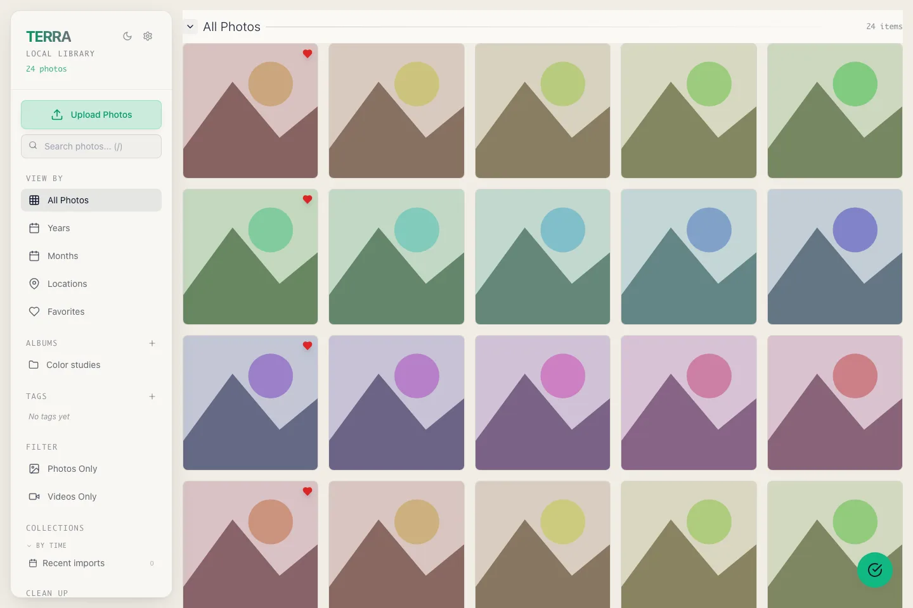
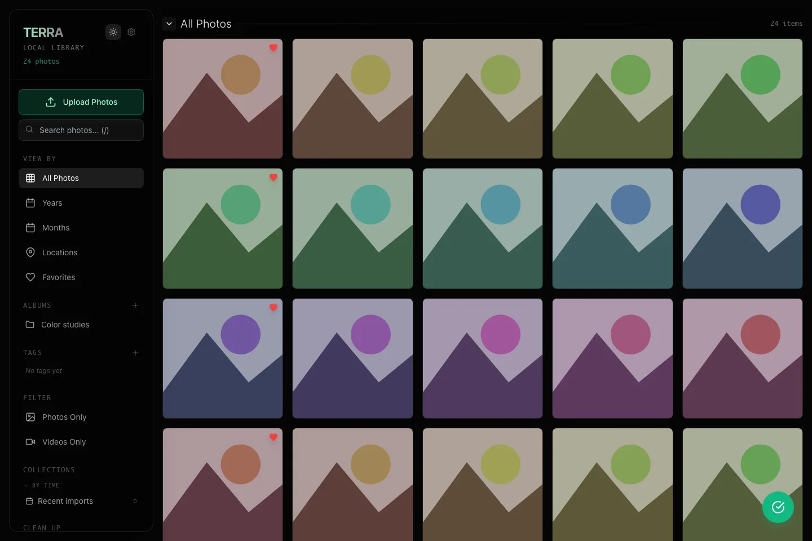

# Terra - Local Photo Gallery

A local-first macOS photo and video library with organization and cleanup tools.



*The React interface with synthetic media and mocked Tauri commands.*



*The same fixture library in dark mode; native import is not exercised.*

Regenerate: `cd docs/screenshots && npm ci && npx playwright install chromium && npm run capture`
(Node.js and `cwebp` required; install the app dependencies first).

## Prerequisites

- macOS 10.15 or newer
- Node.js 18 or newer
- Rust stable toolchain

Install dependencies:

```bash
npm install
```

Run the full Tauri development app:

```bash
npm run tauri:dev
```

Run only the Vite frontend:

```bash
npm run dev
```

## Development Commands

```bash
npm run dev           # Start Vite only
npm run tauri:dev     # Start the full desktop app
npm run build         # Build frontend assets
npm run tauri:build   # Build the desktop app bundle
npm run test:run      # Run frontend tests once
```

Rust checks:

```bash
cd src-tauri
cargo test
cargo check
```

## Verification

After installing dependencies, the standard checks are:

```bash
npm run test:run      # frontend unit tests
npm run build         # frontend build
cd src-tauri
cargo test            # backend unit tests
cargo check           # backend type/lint check
```

`npm audit` may report dependency advisories that should be reviewed before each release.

## Usage

Use **Upload Photos** for local media or **Cloud Import** for downloaded exports.
Organize imports with albums, tags, and favorites; use duplicate and screenshot
review before archiving files. The archive is cleaned after 14 days.
Provider imports use local exports, not cloud account connections.

## Contributing

See [CONTRIBUTING.md](CONTRIBUTING.md). Run `npm run test:run`,
`npm run build`, and `cargo test --manifest-path src-tauri/Cargo.toml`.
Never commit personal media, library databases, or generated thumbnails.

## Documentation

- [Current Status](docs/guide.md#current-status)
- [Tech Stack](docs/guide.md#tech-stack)
- [Architecture](docs/guide.md#architecture)
- [Usage](docs/guide.md#usage)
- [Project Structure](docs/guide.md#project-structure)
- [Known Limitations](docs/guide.md#known-limitations)
- [Roadmap](docs/guide.md#roadmap)

## License

[MIT License](LICENSE).
